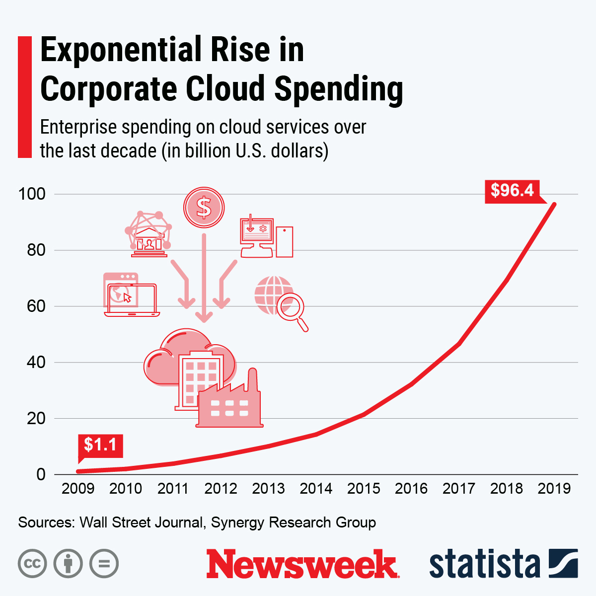
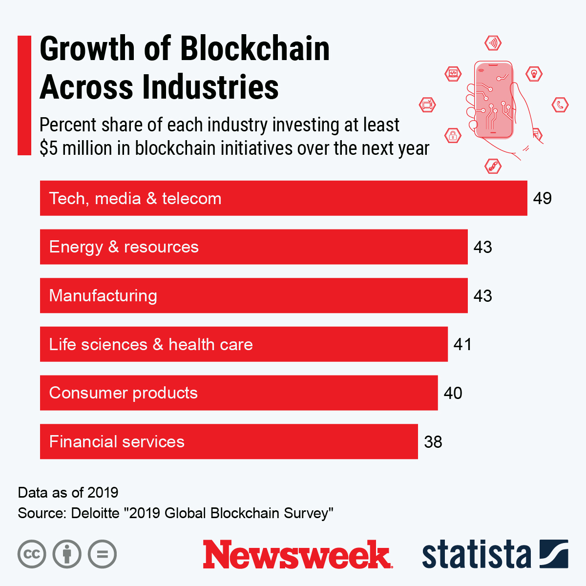
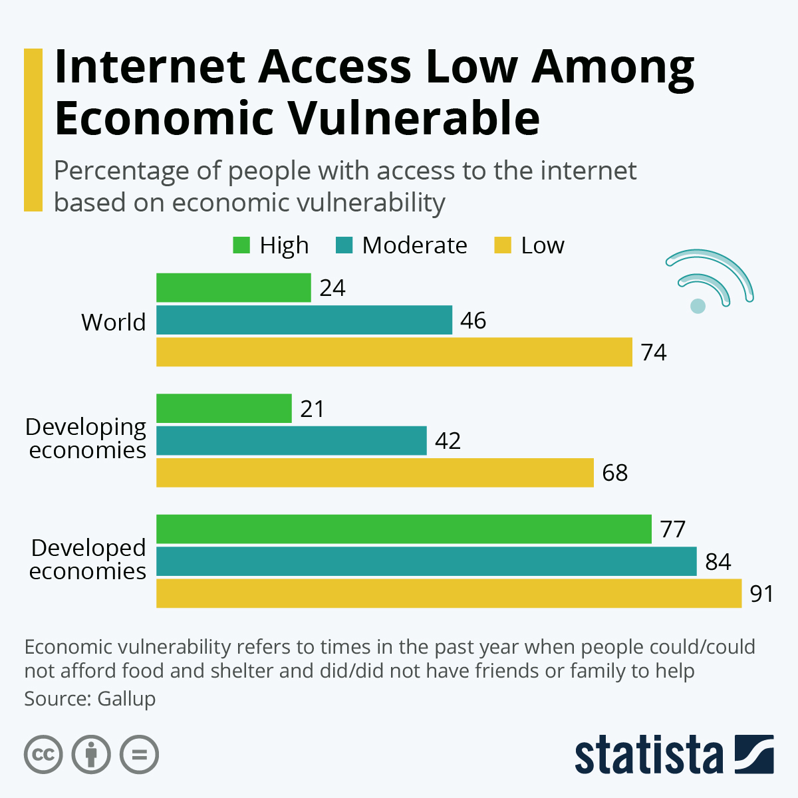
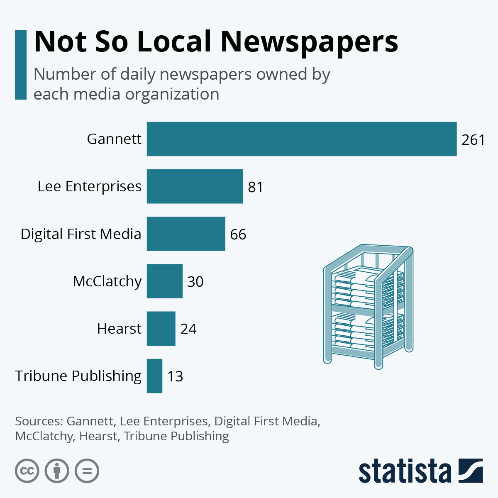

---

### Editorial
#### Datadog

  

    
    
<strong><a href="https://www.datadoghq.com/blog/product-data-best-practices/">What your product data is actually saying</a></strong> <small>Mar 2026</small>

  

  

    
    
<strong><a href="https://www.datadoghq.com/state-of-devsecops/">State of DevSecOps</a></strong> <small>Feb 2026</small>

  

  

    
    
<strong><a href="https://www.datadoghq.com/blog/observability-pipelines-otel-cost-control/">Observability pipelines with OpenTelemetry</a></strong> <small>Nov 2025</small>

  

  

    
    
<strong><a href="https://www.datadoghq.com/state-of-cloud-security/">State of Cloud Security</a></strong> <small>Oct 2025</small>

  

  

    
    
<strong><a href="https://www.datadoghq.com/blog/understanding-java-gc/">A deep dive into Java garbage collectors</a></strong> <small>Oct 2025</small>

  

  

    
    
<strong><a href="https://www.datadoghq.com/blog/migrate-and-onboard-to-cloud-siem/">Migrate and onboard to Cloud SIEM</a></strong> <small>Jul 2025</small>

  

  

    
    
<strong><a href="https://www.datadoghq.com/blog/otel-collector-distributions/">Choosing the right OTel Collector distro</a></strong> <small>Jul 2025</small>

  

  

    
    
<strong><a href="https://www.datadoghq.com/blog/engineering/streaming-platform-kafka-custom-abstractions/">Achieving relentless Kafka reliability at scale</a></strong> <small>Feb 2025</small>

  

  

    
    
<strong><a href="https://www.datadoghq.com/blog/managed-ml-best-practices/">ML platform monitoring: Best practices</a></strong> <small>Apr 2024</small>

  

  

    
    
<strong><a href="https://www.datadoghq.com/blog/best-practices-to-prevent-alert-fatigue/">Alert fatigue: What it is and how to prevent it</a></strong> <small>Jan 2024</small>

  

  

    
    
<strong><a href="https://www.datadoghq.com/state-of-serverless/">The State of Serverless Report</a></strong> <small>Aug 2023</small>

  

  

    
    
<strong><a href="https://www.datadoghq.com/blog/engineering/profiling-improvements-in-go-1-18/">Profiling improvements in Go 1.18</a></strong> <small>Feb 2022</small>

  

### Journalism
#### Newsweek

  

    
    
<strong><a href="https://www.newsweek.com/covid-19-driving-cloud-computing-surge-that-will-only-continue-opinion-1529020">COVID-19 is driving a cloud computing surge that will only continue</a></strong> <small>Mar 2021</small>

  

  

    
    
<strong><a href="https://www.newsweek.com/businesses-are-investing-heavily-blockchain-trust-there-opinion-1529155">Businesses are investing heavily in blockchain. But is the trust there?</a></strong> <small>Sep 2020</small>

  

#### Qualcomm

  

    
    
<strong><a href="https://www.qualcomm.com/news/onq/2021/07/qualcomm-inventor-who-helped-make-wi-fi-faster-and-more-efficient-high-traffic">The Qualcomm inventor who helped make Wi-Fi faster and more efficient for high-traffic networks</a></strong> <small>Jul 2021</small>

  

  

    
    
<strong><a href="https://www.qualcomm.com/news/onq/2021/07/how-dr-lola-awoniyi-oteri-optimizes-5g-through-power-savings-and-mobility">How Dr. Lola Awoniyi-Oteri optimizes 5G through power savings and mobility management inventions</a></strong> <small>Jul 2021</small>

  

  

    
    
<strong><a href="https://www.qualcomm.com/news/onq/2021/06/invention-scalable-numerology-how-dr-tingfang-ji-helped-bring-5g-more-just">The invention of scalable numerology: how Dr. Tingfang Ji helped bring 5G to more than just smartphones</a></strong> <small>Jun 2021</small>

  

#### World Economic Forum + Statista

  

    
    
<strong><a href="https://www.weforum.org/agenda/2021/01/global-warming-chart-average-temperatures-rising/">Here's how temperatures have risen since 1950</a></strong> <small>Jan 2021</small>

  

  

    
    
<strong><a href="https://www.weforum.org/stories/2020/11/offshore-wind-energy-to-double/">Offshore wind energy to double by 2025</a></strong> <small>Nov 2020</small>

  

  

    
    
<strong><a href="https://www.statista.com/chart/22837/internet-access-among-economic-vulnerable/">Internet access low among economic vulnerable</a></strong> <small>Sep 2020</small>

  

  

    
    
<strong><a href="https://www.statista.com/chart/20661/largest-newspaper-publishers-in-america/">Not so local newspapers</a></strong> <small>Jan 2020</small>

  

